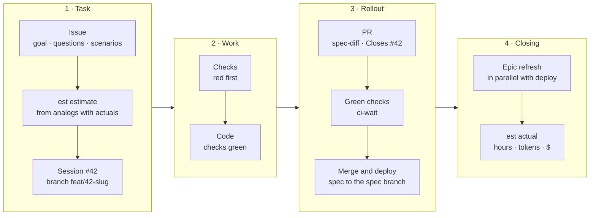

<div align="center">

# ai-dev

**A development flow with AI agents: one canon of rules, skills with scripts<br>and a specification checked by the machine, not by the agent's memory.**

Claude Code · Codex · Gemini CLI · Cursor · Copilot · OpenCode · Amp

[](https://github.com/miroshnik/ai-dev/actions/workflows/ci.yml)
[](https://github.com/miroshnik/ai-dev/releases)
[](https://agentskills.io)
[](https://github.com/miroshnik/ai-dev/tree/spec)

[Why](#why) · [Principles](#principles) · [ai-dev and OpenSpec](#ai-dev-and-openspec) · [Installation](#installation) · [Skills](#skills) · [Layout](#repository-layout)

</div>

---

## What it is

ai-dev is how an agent carries a task from issue to production, written down once for all agents and all projects:

- **The canon** [`AGENTS.md`](AGENTS.md) — the rules: tasks and estimates, branches and PRs, merging and CI, the specification, production.
- **Skills** following the open [Agent Skills](https://agentskills.io) standard — a prompt plus a script for everything deterministic: the GitHub project, estimates from actuals, the spec from tests, waiting for CI.
- **The installer** — puts the flow into a project as a copy (the cloud session, colleagues and CI see it) or onto the machine — only the skills and the hook, for all agents at once; after that, projects get it through releases.

One task — from issue to actual:



## Why

An agent writes code fast. Everything around the code is what becomes slow and expensive:

| Without the flow | With ai-dev |
|---|---|
| Knowledge lives in the chat and in the agent's memory — the next session, another agent or account starts from scratch | Everything decided is in the issue and the repository; before a pause — a State comment, and any agent can continue |
| Specs and rules-as-text go stale silently — you see it only once a bug has happened | Every decision — functional and non-functional — is held by a check; a change without one turns CI red |
| Estimates are guesses — they can't be checked or learned from | An estimate comes from analogs with a measured actual; the actual comes from the agent's transcripts |
| Every project has its own process; one project's lesson doesn't reach another | One canon for all projects and agents; an improvement reaches everyone with a release |
| The agent commits, pushes and merges on its own — or asks about everything every time | Reversible — on its own, irreversible — on an explicit "yes" to a specific action |

## Principles

The full canon is [`AGENTS.md`](AGENTS.md); here is what it stands on.

1. **Code is what is; checks are what should be.** Code describes what the system does and how it is built now, so it can't be the source of what should be. What should be lives in checks, and they are all of the project's decisions: functional — tests in `tests/capabilities`, what the system must do; non-functional — architectural (`tests/architecture`, what it's made of) and standards (`tests/standards`, which rules the code obeys and which qualities it holds: performance, security, accessibility). They diverge — red CI, not silent drift. → [Specification — decisions](AGENTS.md#specification--decisions)
2. **No check — no decision.** A decision exists while a mechanism checks it: behavior — a test, a convention — a lint rule or "registry + invariant", architecture — a C1–C3 model with checks over it, a quality — a budget in a capability's test or a standard's cross-cutting invariant. Prose doesn't have to be true; a test fails. Documentation is generated from test names and published to the `spec` branch after merge: it isn't in `main` — a derived copy would conflict in every parallel PR, and review goes by the diff of requirements (`spec-diff`). → [Specification — decisions](AGENTS.md#specification--decisions)
3. **One fact — one home.** Every fact has exactly one place: a cross-cutting rule — in a standard, behavior — in its capability, a decision's reason — in `<decision>.md` next to its check, the plan and agreements — in the issue, what is shared by all projects — in ai-dev, what is project-specific — in the project's spec. A copy goes stale silently: that's how specs diverge — a change edits one place out of several. → [Project knowledge and handoff](AGENTS.md#project-knowledge-and-handoff)
4. **A check must be able to fail.** A test is written before the code and is red first; a regression test is proven by reverting the fix, an inherited one — by breaking the code. A test that can't fail is worse than a missing one. → [Tests and code](AGENTS.md#tests-and-code)
5. **The issue is the only place to agree.** The goal, `## Questions` with answers, `## Scenarios` — future test names, visible before code; status and links — GitHub fields and relationships. No proposal files, no TODOs, no plan in the agent's memory. → [Task tracking](AGENTS.md#task-tracking)
6. **Session = task = branch = PR.** Session `#42 …`, branch `feat/42-slug`, `Closes #42` in the PR: work is always linked to a task, so the task has an actual. A session won't take a second task into work (`task status` refuses): it goes to Backlog and into a new session. → [Session and branch](AGENTS.md#session-and-branch--one-task)
7. **Estimates from actuals.** Analogs with a measured actual instead of a guess; the actual is the agent's active hours, tokens and their API equivalent in dollars. → [Estimate and actual](AGENTS.md#estimate-and-actual--the-est-skill)
8. **A script instead of memory.** Everything deterministic is in the skills' scripts (TypeScript under Bun, no dependencies): the agent decides, the script does — the same way in every project. → [This file and skills](AGENTS.md#this-file-and-skills)
9. **Irreversible — on an explicit "yes".** Reading, tests, local edits and task tracking — without asking; commit, push, merge, deploy and writes to live databases — with permission for that action and for this time. A project can let the agent run a task entirely by itself — up to merging its own PR on green checks — with the `auto` setting at install; the same install sets the project language the agent talks and writes in. → [What I do without asking and what needs a yes](AGENTS.md#what-i-do-without-asking-and-what-needs-a-yes)
10. **Into `main` — each green on its own.** Merge as soon as the PR's own checks are green, without a queue or an up-to-date-branch requirement; before merging, if `main` moved after the PR's CI — fast checks on the merge with a fresh `main`; after a deploy — waiting for its statuses; a test failed — the root cause is fixed, not a retry added. → [Git, PRs and merging](AGENTS.md#git-prs-and-merging)
11. **One canon, versions by releases.** A project pins a copy of the flow with a commit and updates by release; a session starts by checking whether the flow is behind. → [First step of a session](AGENTS.md#first-step-of-a-session--an-up-to-date-flow)

## ai-dev and OpenSpec

[OpenSpec](https://github.com/Fission-AI/OpenSpec) is a popular spec-driven framework: requirements in Markdown (`SHALL`, `WHEN` / `THEN` scenarios), every change is a folder in `openspec/changes/` with `proposal.md`, `tasks.md`, `design.md` and spec deltas that are merged into `openspec/specs/` after rollout (`/opsx:propose` → `/opsx:apply` → `/opsx:archive`). ai-dev used to run on top of OpenSpec; now it replaces it entirely.

| | OpenSpec | ai-dev |
|---|---|---|
| **Where a requirement lives** | `openspec/specs/<capability>/spec.md` — prose | `tests/capabilities/<capability>/` — `describe` is the requirement, `it` a scenario; it runs |
| **What keeps the spec true** | the agent's discipline; `validate` checks structure, not truth | CI: behavior changed without a test — red |
| **Agreement before code** | `proposal.md`, `tasks.md` | the issue: `## Questions` and `## Scenarios` — future test names |
| **A change in the PR** | ADDED / MODIFIED / REMOVED deltas — separate files written by the agent | `spec-diff` from git: added, changed and removed requirements |
| **Code standards** | text in `config.yaml` and specs | `tests/standards/`: a lint rule or an invariant with a violator, exceptions with a ratchet |
| **Architecture and "why"** | `design.md` in the change archive | a C1–C3 model with checks; the reason — in `<decision>.md` next to the check |
| **Qualities** (performance, security, accessibility) | a prose requirement, like behavior | cross-cutting — a "registry + invariant" standard (audit on every mutation, axe on every page); one capability's budget — in its tests |
| **Documentation** | the specs themselves — read them whole | generated from test names into the `spec` branch |
| **Uncheckable (look, copy)** | a prose requirement | not called spec — acceptance in the issue; where the look is a decision, it's a screenshot test |
| **Tasks, estimates, CI, merge** | out of scope | the canon and skills: GitHub Projects, `est`, `ci-wait` |

### What a live project showed

A product project on OpenSpec: 68 specs, ≈1000 requirements and ≈4000 scenarios — 3 MB of Markdown, plus the change archive.

**Audit before the switch**

- **Specs go stale silently.** Of 11 requirements checked, 6 were stale; three direct contradictions between specs; 23 of 68 specs have "TBD" as their purpose; 14 of 347 file paths lead nowhere. `openspec validate --strict` is green all the while — it checks structure, not truth. The cause is one: a fact is written in several specs, and a change edits its own.
- **The spec and the tests are two independent records of the same behavior.** Of 40 random spec scenarios, 5 were found among test names.
- **Standards are held by code, not by text.** Those built into code are followed (an audit record in 64 of 65 mutations), those written in prose aren't: 26 forbidden constructs, 6 of them added after the rule.
- **Specs are expensive to read.** One spec is 463 KB, over 100k tokens, and to "check against the spec" the agent reads it whole. The archive of 237 changes is 10.9 MB, 19–29% of it makes it into the live specs; `proposal.md` and `tasks.md` repeat the issue. In a measured task ≈26% of what the agent read was OpenSpec artifacts.

**Migration into tests** — 1052 requirements, 13 PRs

- Only 585 requirements (56%) had a test, 255 had one partially, 149 had none at all.
- ≈950 requirements became tests; ≈102 were removed with a reason (look, copy, one-off migrations, infrastructure outside the repository); ≈105 were rewritten from the code — the spec had fallen behind an intentional decision.
- Check by breaking — over 3.6k targeted code breakages — found at least 165 tests that counted as coverage but didn't catch the breakage.
- Along the way, 70 bugs (2 Urgent, 6 High) and 58 standard candidates were found.

How to migrate — the reference [`skills/spec/migration.md`](skills/spec/migration.md): an outcome for every requirement, check by breaking, removal categories, "the spec fell behind the code".

No exaggeration: the spec format isn't the main token cost; what costs more is how many subagents are launched and what they are told to read. Task hours and cost before and after are to be compared by `est` actuals, once a sample accumulates.

**When OpenSpec fits better:** you need a requirements document for people outside the code; the project has no tests and won't have them; you need a "proposal before code" gate as a separate artifact. ai-dev moves this gate into the issue — scenarios are visible before code — but not into a file.

## Installation

You need `git` and Node (for `npx`); skill scripts need [Bun](https://bun.sh) ≥ 1.2 (the `spec` scripts also run under Node ≥ 22.18); the `github`, `est` and `dashboard` skills need [`gh`](https://cli.github.com) with the `project` scope (`gh auth refresh -s project`).

```bash
# into a project — from the root of a git repository; the copy is committed with the project
npx -y github:miroshnik/ai-dev install

# onto the machine — skills and the hook for every agent it has; the rules come from the project
npx -y github:miroshnik/ai-dev install -g
```

Keeping the flow up to date:

```bash
npx -y github:miroshnik/ai-dev check -g    # 0 — up to date, 1 — behind (in a project also: git ignores flow files), 2 — can't check; changes nothing
npx -y github:miroshnik/ai-dev update -g   # bring it to the latest release
```

Without `-g` — the same for the project. Claude Code checks the machine and the project by itself: `install -g` sets up the `SessionStart` hook, and the `check` output lands at the start of every session.

`install` in a project asks in the terminal whether the agent should do tasks entirely by itself — answer the task's questions by recommendation, commit, push, fix CI and merge its own PR on green checks (default — no); without a terminal — `install --auto` or `--no-auto`, without the flag the previous answer stays. `check` names the mode. With auto, `install` prints a hint for Claude Code: the app rejects a merge without human review in this mode too, and the session merges its own PR by itself only with the `Bash(gh pr merge *)` rule in `permissions.allow` of `~/.claude/settings.json` — the owner adds it, `install` doesn't change the machine's permission settings.

`install` also asks for the **project language** the agent works in: dialog, tasks, prompts, documents; the flow itself is written in English. It is stored in `.agents/ai-dev.json` as `language` — a BCP 47 code (`ru`, `en`, `pt-BR`), `en` by default; an install of a previous version without the field counts as `ru`. Without a terminal — `install --lang <code>`, without the flag the previous language stays; `update` keeps it, `check` and the hook name it. The flow isn't installed into an ai-dev clone — `install` writes only these two settings there.

<details>
<summary><b>What goes where</b></summary>

**Into a project** — everything as a copy in `.agents/`, committed with the project: the cloud session (claude.ai/code sees only the repository), colleagues and CI get exactly this version.

- `.agents/ai-dev/` — `AGENTS.md`, `claude/CLAUDE.md`, `docs/*.md`; `.agents/skills/<name>/` — all skills; `.agents/ai-dev.json` — the SHA and release tag it was installed from, the list of skills (a reinstall removes skills that ai-dev no longer has), `auto` — whether the agent runs a task entirely by itself, without a "yes" for commit, push and merge, and `language` — the project language.
- Claude Code — symlinks `.claude/rules/ai-dev.md`, `.claude/rules/ai-dev-claude.md` (loaded automatically, whatever the project's `CLAUDE.md`) and `.claude/skills/<name>`.
- Other agents — a block at the top of the project's `AGENTS.md` linking to `.agents/ai-dev/AGENTS.md` (the whole canon won't fit Codex's budget — 32 KiB for all of a project's `AGENTS.md` files) and `.agents/skills/` — the shared skills location of Codex, Gemini CLI, Cursor, Copilot, OpenCode, Amp.
- Updating — `update` and a commit of the copy, `chore(agents): ai-dev flow <tag>`; exclude `.agents/` and `.claude/` from the project's linters and formatters.
- Flow files that the project's git ignores (a `CLAUDE.md` pattern, the `.claude/` directory, `vendor/`) are un-ignored by `install` and `update` with exceptions — an ai-dev block at the end of `.gitignore`, committed with the copy; what an exception can't un-ignore (a directory excluded by a personal rule), and anything ignored until `update` runs — `❌` in the output of the install and of `check`.

**Onto the machine** (`-g`) — only the skills and the hook, no rules on the machine: the project loads them, and a second copy would be read on every turn of every agent (~20k tokens). `~/.agents/skills` — for all agents; Claude Code also gets `~/.claude/skills` and the `SessionStart` hook in `~/.claude/settings.json`. `install -g` removes the rules of a previous install (`~/.agents/ai-dev`, the symlinks in `~/.claude/rules` and the global files of Codex, Gemini CLI, Copilot CLI, OpenCode, Amp); it doesn't touch a file that isn't its own.

**Personal configuration** — everything that depends on specific repositories (the registry for `est`, your own model prices, notes) — lives outside the flow, in `~/.config/ai-dev`; another directory — the `AI_DEV_CONFIG_DIR` variable, read by all skill scripts. `AI_DEV_PRIVATE=<path>` with `install -g` makes `~/.config/ai-dev` a symlink to a private checkout; with `AI_DEV_CONFIG_DIR` the symlink isn't needed — the variable points at the checkout itself.

</details>

<details>
<summary><b>Releases and the up-to-date check</b></summary>

Projects and machines with a copy get the flow **by releases** — tags `vYYYY.MM.DD` (a same-day patch is `.N`), not the head of `main`: a commit to the rules without a release doesn't make anyone "behind". The commands are the same — the npx package from `main` finds the latest tag and restarts from it.

- `check` changes nothing: it compares a copy with the latest release (the same install as a dry run, a list of differences), a `--link` clone — with `origin/main` after `git fetch`.
- `update`: a copy — reinstalled from the latest release; a clone — `git pull --ff-only` and links to new skills (a clone not on `main` or with edits — refused with a reason).
- `release` — the owner's step: a date tag (UTC) on `origin/main` and a GitHub Release listing the flow and installer changes since the previous release; nothing to release — refused.

</details>

<details>
<summary><b>Working on the flow itself — from a clone</b></summary>

```bash
git clone https://github.com/miroshnik/ai-dev && cd ai-dev
node bin/ai-dev.mjs install -g --link   # symlinks to the clone instead of copies: edits show up immediately
node bin/ai-dev.mjs release --dry-run   # what goes into the release; without --dry-run — cut it
```

</details>

## Skills

Skills are installed with the flow; the agent picks them up by itself — from the description in `SKILL.md`, there's no need to invoke them by hand.

### [`github`](skills/github/SKILL.md) — project and tasks by the canon

Checks and fixes the GitHub project and the default-branch rule, creates a task with all its fields in one command, before merging checks the PR's merge with a fresh `main` if it moved after CI, after merging prints the assignment for the epic-refresh subagent and closes the task in one call — `est` actual, Done, epic and milestone, the merged branch removed — and sets decision labels from the PR diff.

`github project check` · `github project fix` · `github task new | status | drop | actualize | close` · `github pr labels | premerge`

### [`est`](skills/est/SKILL.md) — estimates from actuals

An estimate in one call from analogs with a measured actual, the script picks the analogs; the actual — active hours, tokens and the API equivalent in $ from Claude Code, Codex and cloud session transcripts; a backtest checks the mechanics against manual estimates; a period summary over all of a repo's sessions compares the flow before and after a change.

`est estimate` · `est fact` · `est history` · `est backtest` · `est period` · `est cloud-import`

### [`dashboard`](skills/dashboard/SKILL.md) — sessions at work, estimate, actual and cost

A browser page the script serves itself, with two tabs. Sessions (the main one) — tasks In progress, their sessions and what each one waits for: CI, merge, deploy, a human's answer, working or silent; on top — questions to the owner from the sessions' answers and from tasks. When to call it — "what's up with the sessions", "is anything stuck", "which tasks are hanging". Estimate and actual — estimate and actual in hours by task close date, actual to estimate, tokens and cost, with a rolling median and the $ share per model: whether estimates converge and whether a task gets cheaper after a flow change.

`dashboard [--repo o/r | --all-repos] [--since 90d]`

### [`spec`](skills/spec/SKILL.md) — specification from tests

- `spec-doc` — runner reports (Vitest/Jest, Playwright, `bun test`) over the `tests/` tree → a page per decision, C4 architecture from the model, sequence diagrams from scenario traces.
- `spec-diff` — the spec section for a PR (`## Spec (tests)`): added, changed and removed requirements, the model, exceptions, a check against the task's scenarios section.
- `spec-publish` — after merge, publishes the documentation to the `spec` branch: it isn't in `main`.
- `spec-run` — for publishing on PR merge, finds a green run that checked exactly the merge commit's tree; there is none (a PR that fell behind was merged) — publishing is skipped, the `spec` branch isn't rolled back.
- `spec-claims` — every entry point (route, page, job, command) is called by a capability test — by the call log, not by coverage.
- `spec-break` — proves that a check catches a breakage: break the code → run the test → always revert.
- `spec-exceptions` — moves a project's exceptions from `exceptions.ts` into the `exceptions/` directory of the decision folder, and spec-doc name exceptions into `names.exceptions/`, one file per exception: parallel PRs paying down debt don't conflict.
- `harness.ts` — mechanical checks: "registry + invariant" with a violator, lint-rule examples, exceptions with a ratchet (an element with its own file — a mark in it), the C1–C3 architecture model, dead code (knip, with the config-hints reporter `knip-hints.cjs`), the environment.

### [`ci-wait`](skills/ci-wait/SKILL.md) — wait for checks, don't guess

Waits for all checks of a PR or a commit (a merge commit — by the PR number) — CI, deploy, an external check — with visible progress and PASS / FAIL / TIMEOUT / ERROR outcomes instead of `gh pr checks --watch` and `sleep` in a loop; an Actions run that didn't become a check (the workflow wasn't parsed or didn't start on the PR) is not a PASS; it also waits for a bug about a red `main` to close.

`wait-ci.sh`

### [`slot`](skills/slot/SKILL.md) — the machine's heavy runs in a queue

Project checks — `lint`, `typecheck`, `test`, `test:*` — go through the machine queue: two runs at once, together half the cores, the rest wait in arrival order and print whom they are waiting for; the runner takes its workers from `AI_DEV_SLOT_CPUS`. The flow install puts the wrapper into the `package.json` scripts — both agents and a human in the terminal join the queue; in CI — no queue.

`slot '<command>' [args…]`

### References

Mechanics the canon refers to; the agent reads them as needed.

- [`docs/pr-checks.md`](docs/pr-checks.md) — waiting for PR and commit checks: polling, `bucket`, empty-list traps; a deploy — by the commit status, not by polling the site.
- [`docs/ci-concurrency.md`](docs/ci-concurrency.md) — CI for parallel tasks: the full rule and workflow fragments — parallel branches, a non-cancellable `main`, a deploy queue.
- [`docs/testing.md`](docs/testing.md) — how to test: a run's result by the runner's summary, the environment, e2e without flakes, UI state in the agent's browser — by the DOM, not a screenshot.
- [`docs/judgment.md`](docs/judgment.md) — judgment and edits: a mistake disguised as an outcome, a label is a claim, editing exactly what was named, "it doesn't reproduce for me".
- [`docs/parallel-checkouts.md`](docs/parallel-checkouts.md) — parallel worktrees: the full rule, own port and own database for the server and e2e, a shared `.git/config` — no `git config` in copies.
- [`docs/cloud-sessions.md`](docs/cloud-sessions.md) — the Claude Code cloud session: what it can't access and how to close a task from there.

## Repository layout

```
AGENTS.md          the canon of rules — for all agents
claude/CLAUDE.md   only what Claude Code has
docs/              references the canon links to
skills/<name>/     SKILL.md + scripts/ — TypeScript under Bun, no dependencies
tests/             ai-dev's own spec: capabilities/ and standards/
bin/ai-dev.mjs     the installer — JavaScript: npx runs it from node_modules, where Node doesn't strip types
```

**A skill = a prompt + scripts** following the open [Agent Skills](https://agentskills.io) standard: a `<name>/` folder with `SKILL.md` (frontmatter `name` = the folder name, `description`; body < 500 lines) and `scripts/` for the deterministic part; `reference.md` if needed. Scripts are TypeScript under Bun (`bun script.ts`: no build, no dependencies, imports with `.ts`); script tests — `bun test` in ai-dev's `tests/` over the same tree. The exception is the installer `bin/ai-dev.mjs`: JavaScript, because npx runs it from `node_modules`, where Node doesn't strip types. Third-party code a script can't do without goes into `scripts/vendor/` as a file with its license, not as a dependency: that's how `spec` carries a TypeScript parser (`@babel/parser`). Everything that depends on specific repositories goes into local configuration, not into the skill.

ai-dev lives by its own flow: the spec — [`tests/`](tests), its documentation — in the [`spec` branch](https://github.com/miroshnik/ai-dev/tree/spec), tasks — in [Issues](https://github.com/miroshnik/ai-dev/issues) and the [ai-dev project](https://github.com/users/miroshnik/projects/6).

The spec is read from the branch, not from the working tree — the same in any project with the flow:

```bash
git fetch origin spec
git show origin/spec:README.md                 # table of contents: capabilities, architecture, standards
git show origin/spec:capabilities/est.md       # a decision page: why, what holds, what checks it
```

```bash
bun install
bun test              # script tests and ai-dev standards
bun run typecheck
bun run spec:doc      # docs/spec from test names, --strict
```

The README is part of the flow too: a new skill, command, script subcommand or reference without a line here fails `bun test`, and so does a link to a renamed canon section ([`tests/standards/readme`](tests/standards/readme/readme.md)).
