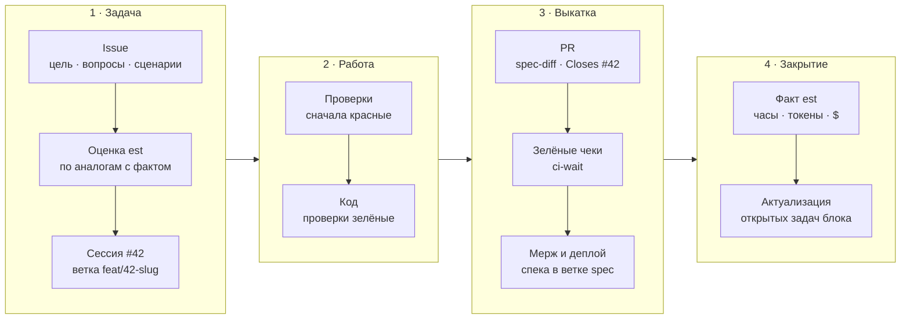

<div align="center">

# ai-dev

**Флоу разработки с ИИ-агентами: один канон правил, скиллы со скриптами<br>и спецификация, которую проверяет машина, а не память агента.**

Claude Code · Codex · Gemini CLI · Cursor · Copilot · OpenCode · Amp

[](https://github.com/miroshnik/ai-dev/actions/workflows/ci.yml)
[](https://github.com/miroshnik/ai-dev/releases)
[](https://agentskills.io)
[](https://github.com/miroshnik/ai-dev/tree/spec)

[Зачем](#зачем) · [Принципы](#принципы) · [ai-dev и OpenSpec](#ai-dev-и-openspec) · [Установка](#установка) · [Скиллы](#скиллы) · [Устройство](#устройство-репозитория)

</div>

---

## Что это

ai-dev — это то, как агент ведёт задачу от issue до прода, записанное один раз для всех агентов и всех проектов:

- **Канон** [`AGENTS.md`](AGENTS.md) — правила: задачи и оценки, ветки и PR, мерж и CI, спецификация, прод.
- **Скиллы** по открытому стандарту [Agent Skills](https://agentskills.io) — промпт плюс скрипт на всё детерминированное: проект GitHub, оценка по фактам, спека из тестов, ожидание CI.
- **Установщик** — ставит флоу в проект копией (её видят облачная сессия, коллеги и CI) или на машину — только скиллы и хук, всем агентам разом; дальше проекты получают его релизами.

Одна задача — от issue до факта:



## Зачем

Агент пишет код быстро. Медленно и дорого становится всё вокруг кода:

| Без флоу | С ai-dev |
|---|---|
| Знание живёт в чате и в памяти агента — следующая сессия, другой агент или аккаунт начинает с нуля | Всё, что решили, — в issue и в репозитории; перед паузой — комментарий «Состояние», любой агент продолжит |
| Спеки и правила-текстом устаревают молча — это видно, только когда случился баг | Каждое решение — функциональное и нефункциональное — держит проверка; изменилось без неё — CI красный |
| Оценки берутся из головы — их не проверить и на них не научиться | Оценка — по аналогам с измеренным фактом; факт — из транскриптов агента |
| У каждого проекта свой процесс, урок одного не доходит до другого | Один канон для всех проектов и агентов; улучшение приходит всем релизом |
| Агент сам коммитит, пушит, мержит — или каждый раз спрашивает обо всём | Обратимое — сам, необратимое — по явному «да» на конкретное действие |

## Принципы

Полный канон — [`AGENTS.md`](AGENTS.md); здесь — на чём он стоит.

1. **Код — что есть, проверки — что должно быть.** Код описывает, что система делает и как она устроена сейчас, поэтому источником должного быть не может. Должное — в проверках, и это все решения проекта: функциональные — тесты `tests/capabilities`, что система должна делать; нефункциональные — архитектурные (`tests/architecture`, из чего она состоит) и стандарты (`tests/standards`, каким правилам подчиняется код и какие качества держит: производительность, безопасность, доступность). Разошлись — красный CI, а не тихий дрейф. → [Спецификация — решения](AGENTS.md#спецификация--решения)
2. **Нет проверки — нет решения.** Решение существует, пока его проверяет механизм: поведение — тест, соглашение — линт-правило или «реестр + инвариант», архитектура — модель C1–C3 с проверками над ней, качество — бюджет в тесте возможности или сквозной инвариант стандарта. Проза не обязана быть верной, тест — падает. Документация генерируется из названий тестов и после мержа публикуется в ветку `spec`: в `main` её нет — производная копия конфликтовала бы в каждом параллельном PR, а ревью идёт по диффу требований (`spec-diff`). → [Спецификация — решения](AGENTS.md#спецификация--решения)
3. **Один факт — один дом.** У каждого факта ровно одно место: сквозное правило — в стандарте, поведение — в своей capability, причина решения — в `<решение>.md` рядом с его проверкой, план и договорённости — в issue, общее для всех проектов — в ai-dev, частное — в спеке проекта. Копия устаревает молча: так и расходятся спеки — изменение правит одно место из нескольких. → [Знание проекта и передача работы](AGENTS.md#знание-проекта-и-передача-работы)
4. **Проверка обязана уметь упасть.** Тест пишется до кода и сначала красный, регрессионный доказывается откатом фикса, унаследованный — поломкой кода. Тест, который не может упасть, хуже отсутствующего. → [Тесты и код](AGENTS.md#тесты-и-код)
5. **Issue — единственное место согласования.** Цель, «## Вопросы» с ответами, «## Сценарии» — будущие названия тестов, которые видны до кода; статус и связи — поля и отношения GitHub. Ни proposal-файлов, ни TODO, ни плана в памяти агента. → [Ведение задач](AGENTS.md#ведение-задач)
6. **Сессия = задача = ветка = PR.** Сессия `#42 …`, ветка `feat/42-slug`, в PR — `Closes #42`: работа всегда привязана к задаче, поэтому у задачи есть факт. Вторую задачу сессия в работу не возьмёт (`task status` откажет): она уходит в «Бэклог» и в новую сессию. → [Сессия и ветка](AGENTS.md#сессия-и-ветка--одна-задача)
7. **Оценка — по фактам.** Аналоги с измеренным фактом вместо оценки из головы; факт — активные часы агента, токены и их API-эквивалент в долларах. → [Оценка и факт](AGENTS.md#оценка-и-факт--скилл-est)
8. **Скрипт вместо памяти.** Всё детерминированное — в скриптах скиллов (TypeScript под Bun, без зависимостей): агент решает, скрипт делает — одинаково в каждом проекте. → [Этот файл и скиллы](AGENTS.md#этот-файл-и-скиллы)
9. **Необратимое — по явному «да».** Чтение, тесты, локальные правки и ведение задач — без спроса; commit, push, мерж, деплой и записи в живые базы — по разрешению на это действие и на этот раз. Проект может разрешить агенту вести задачу целиком самому — до мержа своего PR по зелёным чекам — настройкой `auto` при установке. → [Что без спроса, а что — по разрешению](AGENTS.md#что-делаю-без-спроса-а-что--по-разрешению)
10. **В `main` — зелёное по отдельности.** Мерж — как только чеки своего PR зелёные, без очереди и требования актуальной ветки; перед мержем, если `main` ушёл после CI PR, быстрые проверки — на слиянии со свежим `main`; после деплоя — ожидание его статусов; упал тест — чинится корень, а не ставится ретрай. → [Git, PR и мерж](AGENTS.md#git-pr-и-мерж)
11. **Один канон, версии — релизами.** Проект фиксирует копию флоу коммитом и обновляется релизом; сессия начинается с проверки, не отстал ли флоу. → [Первый шаг сессии](AGENTS.md#первый-шаг-сессии--актуальный-флоу)

## ai-dev и OpenSpec

[OpenSpec](https://github.com/Fission-AI/OpenSpec) — популярный spec-driven фреймворк: требования в Markdown (`SHALL`, сценарии `WHEN` / `THEN`), каждое изменение — папка в `openspec/changes/` с `proposal.md`, `tasks.md`, `design.md` и дельтами спек, которые после выкатки сливаются в `openspec/specs/` (`/opsx:propose` → `/opsx:apply` → `/opsx:archive`). ai-dev раньше работал поверх OpenSpec, теперь заменяет его целиком.

| | OpenSpec | ai-dev |
|---|---|---|
| **Где требование** | `openspec/specs/<capability>/spec.md` — проза | `tests/capabilities/<capability>/` — `describe` требование, `it` сценарий; исполняется |
| **Что держит спеку верной** | дисциплина агента; `validate` проверяет структуру, а не правду | CI: поведение изменилось без теста — красный |
| **Согласование до кода** | `proposal.md`, `tasks.md` | issue: «## Вопросы» и «## Сценарии» — будущие названия тестов |
| **Изменение в PR** | дельты ADDED / MODIFIED / REMOVED — отдельные файлы, их пишет агент | `spec-diff` из git: добавленные, изменённые и снятые требования |
| **Стандарты кода** | текст в `config.yaml` и спеках | `tests/standards/`: линт-правило или инвариант с нарушителем, исключения с храповиком |
| **Архитектура и «почему»** | `design.md` в архиве изменений | модель C1–C3 с проверками; причина — в `<решение>.md` рядом с проверкой |
| **Качества** (производительность, безопасность, доступность) | требование прозой, как и поведение | сквозное — стандарт «реестр + инвариант» (аудит на каждой мутации, axe на каждой странице); бюджет одной возможности — в её тестах |
| **Документация** | сами спеки — читать целиком | генерируется из названий тестов в ветку `spec` |
| **Непроверяемое (вид, тексты)** | требование прозой | спекой не называется — приёмка в issue; где вид — решение, это скриншот-тест |
| **Задачи, оценки, CI, мерж** | вне охвата | канон и скиллы: GitHub Projects, `est`, `ci-wait` |

### Что показал живой проект

Продуктовый проект на OpenSpec: 68 спек, ≈1000 требований и ≈4000 сценариев — 3 МБ Markdown, плюс архив изменений.

**Аудит перед переходом**

- **Спеки устаревают молча.** Из 11 проверенных требований устарели 6; три прямых противоречия между спеками; у 23 из 68 спек назначение — «TBD»; 14 из 347 путей к файлам ведут в никуда. `openspec validate --strict` при этом зелёный — он проверяет структуру, а не правду. Причина одна: факт записан в нескольких спеках, изменение правит свою.
- **Спека и тесты — две независимые записи одного поведения.** Из 40 случайных сценариев спек среди названий тестов нашлось 5.
- **Стандарты держатся кодом, а не текстом.** Встроенные в код соблюдаются (запись аудита — в 64 из 65 мутаций), записанные прозой — нет: 26 запрещённых конструкций, 6 из них добавлены уже после правила.
- **Спеки дорого читать.** Одна спека — 463 КБ, больше 100 тыс. токенов, а чтобы «сверяться со спекой», агент читает её целиком. Архив из 237 изменений — 10,9 МБ, в живые спеки из него попадает 19–29 %; `proposal.md` и `tasks.md` повторяют issue. В замеренной задаче ≈26 % прочитанного агентом — артефакты OpenSpec.

**Перенос в тесты** — 1052 требования, 13 PR

- Тест нашёлся только у 585 требований (56 %), у 255 — частично, у 149 — не было вовсе.
- ≈950 требований стали тестами; ≈102 сняты с причиной (вид, тексты, разовые миграции, инфраструктура вне репозитория); ≈105 переписаны по коду — спека отстала от намеренного решения.
- Проверка поломкой — больше 3,6 тыс. точечных поломок кода — нашла не меньше 165 тестов, которые числились покрытием, но поломку не ловили.
- Попутно найдено 70 багов (2 Urgent, 6 High) и 58 кандидатов в стандарты.

Как переносить — справочник [`skills/spec/migration.md`](skills/spec/migration.md): исход у каждого требования, проверка поломкой, категории снятия, «спека отстала от кода».

Без преувеличений: формат спеки — не главный расход токенов, больше стоит то, сколько субагентов запускается и что им велено читать. Сравнение часов и стоимости задач до и после — по фактам `est`, когда наберётся выборка.

**Когда OpenSpec подойдёт лучше:** нужен документ требований для людей вне кода; в проекте нет и не будет тестов; нужны ворота «proposal до кода» отдельным артефактом. ai-dev переносит эти ворота в issue — сценарии видны до кода, — но не в файл.

## Установка

Нужны `git` и Node (для `npx`); скриптам скиллов — [Bun](https://bun.sh) ≥ 1.2 (скрипты `spec` идут и под Node ≥ 22.18); скиллам `github`, `est` и `dashboard` — [`gh`](https://cli.github.com) со scope `project` (`gh auth refresh -s project`).

```bash
# в проект — из корня git-репозитория; копия коммитится вместе с проектом
npx -y github:miroshnik/ai-dev install

# на машину — скиллы и хук всем агентам, которые на ней есть; правила — из проекта
npx -y github:miroshnik/ai-dev install -g
```

Держать флоу актуальным:

```bash
npx -y github:miroshnik/ai-dev check -g    # 0 — актуально, 1 — отстаёт, 2 — не проверить; ничего не меняет
npx -y github:miroshnik/ai-dev update -g   # довести до последнего релиза
```

Без `-g` — то же для проекта. Claude Code сверяет машину и проект сам: `install -g` ставит хук `SessionStart`, вывод `check` — в начале каждой сессии.

`install` в проекте спрашивает в терминале, делать ли агенту задачи целиком самому — отвечать на вопросы задачи по рекомендации, коммитить, пушить, чинить CI и мержить свой PR по зелёным чекам (по умолчанию — нет); без терминала — `install --auto` или `--no-auto`, без флага ответ прежний. Режим называет `check`. С auto `install` печатает подсказку для Claude Code: мерж без ревью человека приложение отклоняет и в этом режиме, сессия вливает свой PR сама только с правилом `Bash(gh pr merge *)` в `permissions.allow` файла `~/.claude/settings.json` — его ставит владелец, `install` настройки разрешений машины не меняет. В клон ai-dev флоу не ставится — `install` пишет в нём только эту настройку.

<details>
<summary><b>Что куда ставится</b></summary>

**В проект** — всё копией в `.agents/`, коммитится вместе с проектом: облачная сессия (claude.ai/code видит только репозиторий), коллеги и CI получают ровно эту версию.

- `.agents/ai-dev/` — `AGENTS.md`, `claude/CLAUDE.md`, `docs/*.md`; `.agents/skills/<name>/` — все скиллы; `.agents/ai-dev.json` — SHA и тег релиза, из которого поставлено, список скиллов (переустановка убирает скиллы, которых в ai-dev больше нет) и `auto` — ведёт ли агент задачу целиком сам, без «да» на commit, push и мерж.
- Claude Code — симлинки `.claude/rules/ai-dev.md`, `.claude/rules/ai-dev-claude.md` (грузятся сами, при любом `CLAUDE.md` проекта) и `.claude/skills/<name>`.
- Остальные агенты — блок в начале `AGENTS.md` проекта со ссылкой на `.agents/ai-dev/AGENTS.md` (целиком канон не влезет в бюджет Codex — 32 КиБ на все `AGENTS.md` проекта) и `.agents/skills/` — общая точка скиллов Codex, Gemini CLI, Cursor, Copilot, OpenCode, Amp.
- Обновление — `update` и коммит копии `chore(agents): флоу ai-dev <тег>`; `.agents/` и `.claude/` исключить из линтеров и форматтеров проекта.

**На машину** (`-g`) — только скиллы и хук, правил на машине нет: их грузит проект, а вторая копия читалась бы на каждом ходу каждого агента (~20k токенов). `~/.agents/skills` — всем агентам; Claude Code — ещё `~/.claude/skills` и хук `SessionStart` в `~/.claude/settings.json`. Правила прошлой установки (`~/.agents/ai-dev`, симлинки `~/.claude/rules` и глобальных файлов Codex, Gemini CLI, Copilot CLI, OpenCode, Amp) `install -g` убирает; чужой файл не трогает.

**Личная конфигурация** — всё, что зависит от конкретных репозиториев (реестр для `est`, свои цены моделей, заметки), — живёт вне флоу, в `~/.config/ai-dev`; другой каталог — переменная `AI_DEV_CONFIG_DIR`, её читают все скрипты скиллов. `AI_DEV_PRIVATE=<путь>` при `install -g` делает `~/.config/ai-dev` симлинком на приватный чекаут; с `AI_DEV_CONFIG_DIR` симлинк не нужен — переменная указывает на чекаут сама.

</details>

<details>
<summary><b>Релизы и проверка актуальности</b></summary>

Проекты и машины с копией получают флоу **релизами** — тегами `vГГГГ.ММ.ДД` (патч того же дня — `.N`), а не головой `main`: коммит в правила без релиза никого «отставшим» не делает. Команды те же — пакет npx из `main` находит последний тег и перезапускается из него.

- `check` ничего не меняет: копию сверяет с последним релизом (та же установка вхолостую, список отличий), клон `--link` — с `origin/main` после `git fetch`.
- `update`: копия — переустановка последним релизом; клон — `git pull --ff-only` и ссылки на новые скиллы (клон не на `main` или с правками — отказ с причиной).
- `release` — шаг владельца: тег по дате (UTC) на `origin/main` и GitHub Release со списком изменений флоу и установщика с прошлого релиза; выпускать нечего — отказ.

</details>

<details>
<summary><b>Работа над самим флоу — из клона</b></summary>

```bash
git clone https://github.com/miroshnik/ai-dev && cd ai-dev
node bin/ai-dev.mjs install -g --link   # симлинки на клон вместо копий: правки видны сразу
node bin/ai-dev.mjs release --dry-run   # что войдёт в релиз; без --dry-run — выпустить
```

</details>

## Скиллы

Скиллы ставятся вместе с флоу; агент подхватывает их сам — по описанию в `SKILL.md`, вызывать руками не нужно.

### [`github`](skills/github/SKILL.md) — проект и задачи по канону

Сверяет и чинит проект GitHub и правило основной ветки, заводит задачу со всеми полями одной командой, перед мержем проверяет слияние PR со свежим `main`, если тот ушёл после CI, после мержа закрывает задачу одним вызовом — факт `est`, «Готово», эпик и milestone, влитая ветка долой, — ставит метки решений по диффу PR.

`github project check` · `github project fix` · `github task new | status | drop | close` · `github pr labels | premerge`

### [`est`](skills/est/SKILL.md) — оценка по фактам

Оценка — по аналогам с измеренным фактом; факт — активные часы, токены и API-эквивалент в $ из транскриптов Claude Code, Codex и облачных сессий.

`est estimate` · `est fact` · `est history` · `est cloud-import`

### [`dashboard`](skills/dashboard/SKILL.md) — оценка, факт и цена по времени

Страница в браузере, которую скрипт сервит сам: по дате закрытия задач — оценка и факт в часах, факт к оценке, токены и стоимость, со скользящей медианой. Видно, сходятся ли оценки и дешевеет ли задача после правки флоу.

`dashboard [--repo o/r | --all-repos] [--since 90d]`

### [`spec`](skills/spec/SKILL.md) — спецификация из тестов

- `spec-doc` — отчёты раннеров (Vitest/Jest, Playwright, `bun test`) по дереву `tests/` → страница на решение, архитектура C4 из модели, сиквенс-схемы из трасс сценариев.
- `spec-diff` — раздел «Спека» для PR: добавленные, изменённые и снятые требования, модель, исключения, сверка с «## Сценарии» задачи.
- `spec-publish` — после мержа публикует документацию в ветку `spec`: в `main` её нет.
- `spec-run` — для публикации на мерж PR находит зелёный прогон, проверивший ровно дерево коммита мержа; такого нет (влит отставший PR) — публикация пропускается, ветка `spec` не откатывается.
- `spec-claims` — каждая точка входа (маршрут, страница, job, команда) вызвана тестом capability — по журналу вызовов, а не по покрытию.
- `spec-break` — доказывает, что проверка ловит поломку: сломать код → прогнать тест → всегда откатить.
- `harness.ts` — механические проверки: «реестр + инвариант» с нарушителем, примеры линт-правил, исключения с храповиком, модель архитектуры C1–C3, мёртвый код, окружение.

### [`ci-wait`](skills/ci-wait/SKILL.md) — дождаться чеков, а не угадать

Ждёт все чеки PR или коммита — CI, деплой, внешний чек — с видимым прогрессом и исходами PASS / FAIL / TIMEOUT / ERROR вместо `gh pr checks --watch` и `sleep` в цикле.

`wait-ci.sh`

### Справочники

Механика, на которую ссылается канон; агент читает их по мере надобности.

- [`docs/pr-checks.md`](docs/pr-checks.md) — ожидание чеков PR и коммита: опрос, `bucket`, ловушки пустого списка.
- [`docs/ci-concurrency.md`](docs/ci-concurrency.md) — CI параллельных задач: правило целиком и фрагменты workflow — параллельные ветки, неотменяемый `main`, очередь деплоя.
- [`docs/testing.md`](docs/testing.md) — как тестировать: итог прогона по сводке раннера, окружение, e2e без флаки.
- [`docs/parallel-checkouts.md`](docs/parallel-checkouts.md) — параллельные worktree: правило целиком, свой порт и своя база для сервера и e2e.
- [`docs/cloud-sessions.md`](docs/cloud-sessions.md) — облачная сессия Claude Code: что ей недоступно и как закрыть задачу оттуда.

## Устройство репозитория

```
AGENTS.md          канон правил — для всех агентов
claude/CLAUDE.md   только то, что есть у Claude Code
docs/              справочники, на которые ссылается канон
skills/<name>/     SKILL.md + scripts/ — TypeScript под Bun, без зависимостей
tests/             спека самого ai-dev: capabilities/ и standards/
bin/ai-dev.mjs     установщик — JavaScript: npx запускает его из node_modules, где Node типы не стирает
```

**Скилл = промпт + скрипты** по открытому стандарту [Agent Skills](https://agentskills.io): папка `<name>/` с `SKILL.md` (frontmatter `name` = имя папки, `description`; тело < 500 строк) и `scripts/` для детерминированной части; при необходимости `reference.md`. Скрипты — TypeScript под Bun (`bun script.ts`: без сборки, без зависимостей, импорт с `.ts`); тесты скриптов — `bun test` в `tests/` ai-dev по тому же дереву. Исключение — установщик `bin/ai-dev.mjs`: JavaScript, потому что npx запускает его из `node_modules`, где Node типы не стирает. Всё, что зависит от конкретных репозиториев, — в локальную конфигурацию, не в скилл.

ai-dev живёт по собственному флоу: спека — [`tests/`](tests), документация по ней — в [ветке `spec`](https://github.com/miroshnik/ai-dev/tree/spec), задачи — в [Issues](https://github.com/miroshnik/ai-dev/issues) и [проекте ai-dev](https://github.com/users/miroshnik/projects/6).

Спеку читают из ветки, а не из рабочего дерева — так же в любом проекте с флоу:

```bash
git fetch origin spec
git show origin/spec:README.md                 # оглавление: возможности, архитектура, стандарты
git show origin/spec:capabilities/est.md       # страница решения: зачем, что верно, чем проверено
```

```bash
bun install
bun test              # тесты скриптов и стандарты ai-dev
bun run typecheck
bun run spec:doc      # docs/spec из названий тестов, --strict
```

README — тоже часть флоу: новый скилл, команда, подкоманда скрипта или справочник без строки здесь валит `bun test`, ссылка на переименованный раздел канона — тоже ([`tests/standards/readme`](tests/standards/readme/readme.md)).
